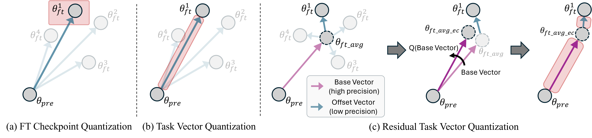

# Task Vector Quantization for Memory-Efficient Model Merging (ICCV 2025)

> Authors: [Youngeun Kim<sup>1*](https://youngryan1993.github.io/homepage/), [Seunghwan Lee<sup>2*](https://nomis911.github.io/), [Aecheon Jung<sup>2*](https://sites.google.com/view/kasurashan), [Bogon Ryu<sup>2](https://gony-ryu.github.io/), [Sungeun Hong<sup>2</sup>&dagger;](https://www.csehong.com/) <br>
> <sup>1</sup>Yale University, <sup>2</sup>Sungkyunkwan University

<a href="https://aim-skku.github.io/TVQ/"></a> &ensp; <a href="https://arxiv.org/pdf/2503.06921"></a> &ensp;


<p align=center></p>


## Abstract
> Model merging enables efficient multi-task models by combining task-specific fine-tuned checkpoints. However, storing multiple task-specific checkpoints requires significant memory, limiting scalability and restricting model merging to larger models and diverse tasks. In this paper, we propose quantizing task vectors (i.e., the difference between pre-trained and fine-tuned checkpoints) instead of quantizing fine-tuned checkpoints. We observe that task vectors exhibit a narrow weight range, enabling low precision quantization (≤ 4 bit) within existing task vector merging frameworks. To further mitigate quantization errors within ultra-low bit precision (e.g., 2 bit), we introduce Residual Task Vector Quantization, which decomposes the task vector into a base vector and offset component. We allocate bits based on quantization sensitivity, ensuring precision while minimizing error within a memory budget. Experiments on image classification and dense prediction show our method maintains or improves model merging performance while using only 8% of the memory required for full-precision checkpoints.


## Prerequisite

1. **Clone this repo**

    ```bash
    git clone https://github.com/AIM-SKKU/TVQ.git
    ```

2. **Setting the environment**
   - Please refer to dependencies in the [task vectors](https://github.com/mlfoundations/task_vectors).

4. **Prepare data**
   - Most datasets being used should be downloaded automatically with torchvision or huggingface. For the datasets requiring manual preparation, please follow the instructions in  [this issue](https://github.com/mlfoundations/task_vectors/issues/1). Depending on the torchvision version, some issues might arise when downloading specific datasets like  [here](https://github.com/basveeling/pcam/issues/4)  or  [here](https://github.com/pytorch/vision/issues/5662). In this case, using a different torchvision version might solve the issue.

6. **Download checkpoints**
   - You can download full-precision fine-tuned checkpoints from the [task_vectors GitHub repository](https://github.com/mlfoundations/task_vectors#checkpoints) or via [Google Drive](https://drive.google.com/drive/folders/1u_Tva6x0p6oxu5Eo0ZZsf-520Cc_3MKw).


## Task Vector Quantization

The script `quantize_task_vector.py` supports three types of weight quantization:

-   Finetuned Model Quantization
-   Task Vector Quantization
-   Residual Task Vector Quantization

All quantization settings are controlled via a JSON configuration file:

```bash
python quantize_task_vector.py --quantize-config configs/quantize_config.json
```

### Example: `configs/quantize_config.json`

<pre><code>{ 
	"quantize_target": "task_vector", 
	"quantize_residual": false, 
	"quantize_task_bit": 4, 
	"quantize_base_bit": null, 
	"q_error_correction": false 
} </code></pre>

**Configuration details**
 
 - `quantize_target` - Which model to quantize: `"finetuned_model"` or `"task_vector"`

- `quantize_residual` - Set to `true` to enable **Residual Task Vector Quantization (RTVQ)**
 	- ⚠️ If you're using RTVQ, make sure to first generate the averaged finetuned model beforehand (used to compute the base vector):
    
		```bash
		python get_avg_model_statedict.py
		```

- `quantize_task_bit` - Bit precision for the task vector, residual vector, or finetuned model

- `quantize_base_bit` - Bit precision for base vectors

- `q_error_correction` - Enables quantization error correction for the base vector


## Evaluation

After quantizing task vectors or finetuned models, you can evaluate the impact of quantization on multi-task performance using various merging strategies. Before running the evaluation, please modify `model_location` and `data_location` in `main.py`.

```bash
python main.py --method <MERGING_METHOD> --load-config configs/load_config.json
```

**Supported merging methods**: `task_arithmetic`, `lines`, `adamerging`, `emr_merging`


### Example: `configs/load_config.json`

This configuration defines **which checkpoint to load** and **the bit precision to use** during evaluation.

<pre><code>{ 
	"load_tv_type": "quantized_task_vector",
	"load_task_bits": 4,
	"load_base_bits": null
} </code></pre>

**Configuration details**
-   `load_tv_type` –  `"baseline"`,  `"quantized_finetuned"`, `"quantized_task_vector"`,  `"quantized_residual_task_vector"`
-   `load_task_bits` – Bit precision for the task vector, residual vector, or finetuned model
-   `load_base_bits` – Bit precision for the base vector


## To-Do List
- [ ] Additional merging methods (`ties_merging`,  `tall_masks`)
- [ ] Quantized checkpoint release


## Citation

```
@article{kim2025task,
  title={Task vector quantization for memory-efficient model merging},
  author={Kim, Youngeun and Lee, Seunghwan and Jung, Aecheon and Ryu, Bogon and Hong, Sungeun},
  journal={arXiv preprint arXiv:2503.06921},
  year={2025}
}
```

## Acknowledgement

We acknowledge the following code, which served as a reference for our implementation.

- https://github.com/EnnengYang/AdaMerging
- https://github.com/mlfoundations/task_vectors
- https://github.com/wang-kee/LiNeS
- https://github.com/harveyhuang18/EMR_Merging
